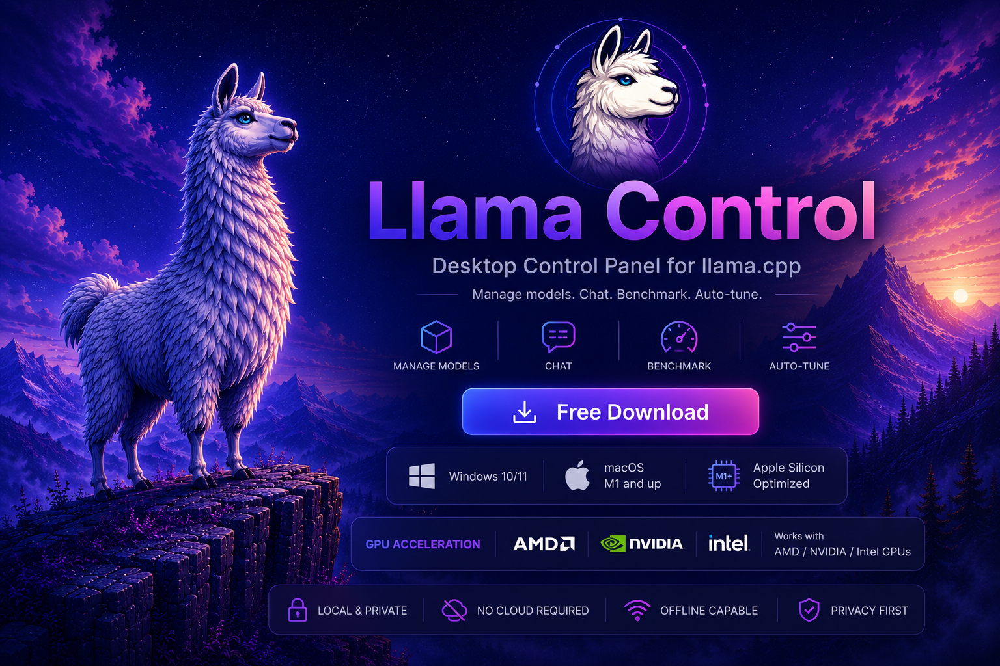

# Llama Control

**Run AI language models on your own PC, without ever touching a command line.**

[-000000?logo=apple&logoColor=white)](#getting-started)

**[English](#english)** · **[Polski](#polski)**

<!--
Topics: local LLM GUI, llama.cpp frontend, run LLM locally Windows, run LLM locally macOS,
Apple Silicon local LLM, GGUF model manager, offline AI chat app, self-hosted LLM launcher,
NVIDIA CUDA / AMD Intel Vulkan GPU acceleration, Metal GPU acceleration, Hugging Face model
downloader, no command line AI, private local ChatGPT alternative.
-->

---

## What is Llama Control?

**Llama Control is a free desktop app for Windows and macOS (Apple Silicon) that lets you run AI language models (LLMs) locally on your own PC through a graphical interface, no command line required.** It's a lightweight GUI wrapper around **[llama.cpp](https://github.com/ggml-org/llama.cpp)**, the open-source engine that actually runs the models: Llama Control installs and updates that engine for you, downloads **GGUF** model files from Hugging Face, auto-tunes their settings, and starts or stops a local AI chat server with one click. All inference happens on-device: no account, no cloud, no telemetry.

**Llama Control to darmowa aplikacja na Windows i macOS (Apple Silicon) do uruchamiania modeli AI (LLM) lokalnie, na własnym komputerze, bez linii poleceń**: nakładka graficzna na silnik **llama.cpp**, która sama instaluje silnik, pobiera modele GGUF z Hugging Face, dobiera i testuje ich ustawienia oraz uruchamia/zatrzymuje lokalny serwer AI jednym kliknięciem. Wszystko działa lokalnie: bez konta, bez chmury, bez telemetrii.

### At a glance

| Specification | Details |
|---|---|
| Category | Desktop GUI / launcher for local LLM inference |
| Inference engine | [llama.cpp](https://github.com/ggml-org/llama.cpp) (installed and updated automatically) |
| Platforms | Windows 10, Windows 11, macOS (Apple Silicon, M1 and later); Linux planned |
| GPU acceleration | NVIDIA via CUDA · AMD & Intel via Vulkan · Metal on Apple Silicon · CPU-only fallback |
| Model format | GGUF, downloaded directly from Hugging Face |
| Recognized model families | Qwen, Llama, Mistral, Gemma, DeepSeek, Nemotron |
| Price / account | Free, no account, no subscription |
| Source model | App is closed-source; the underlying engine (llama.cpp) is open-source |
| Data & privacy | 100% local inference; no telemetry; optional cloud AI features require your own API key |
| Key features | Model manager, one-click server start/stop, Hugging Face browser with VRAM-fit check, AI-assisted auto-tune with real-load testing, built-in split-pane terminal, auto-update |

---

## English

**Llama Control** is a free desktop app that helps you run and manage AI language models (like a local "ChatGPT") on your own hardware. No account, no subscription, and your conversations never leave your computer.

### How it works

AI models live locally on your disk as files (in the **GGUF** format). To make a model actually "come alive" and let you talk to it, you need an engine to run it. Llama Control uses **[llama.cpp](https://github.com/ggml-org/llama.cpp)**, one of the most popular open-source engines for running AI models locally.

Llama Control is a friendly **wrapper** around that engine:

- **Keeps track of your models.** Shows a list, their size, when they were downloaded, and lets you tag them as favorites or add notes. Models from the well-known families (Qwen, Llama, Mistral, Gemma, DeepSeek, Nemotron) are recognised by their filename and shown with their logo.
- **Installs the llama.cpp engine for you** if you don't already have it, picking the right build for your graphics card.
- **Starts and stops a model with one click.** No typing anything into a console.
- **Lets you download new models** straight from HuggingFace (think of it as a "store" for AI models) and tells you right away whether a given model will fit in your GPU's memory.

  

- **Can figure out good settings for you, and actually checks them.** An AI assistant proposes a starting configuration for a model, then an "auto-tune" mode can launch it for real, test it under real load, and automatically back off to safer settings if something crashes, instead of just guessing and hoping.
- **Ships a built-in terminal**, side by side with chat. Split it into as many panes as you need, and each one keeps running, including whatever's inside it, even while you're looking at a different tab.

  

- **Updates itself** whenever a new version comes out.

In short: you install it, the app figures out the rest, you just click.

#### Why llama.cpp instead of Ollama or LM Studio?

This isn't meant to be another standalone AI engine competing with those. It's deliberately a **lightweight wrapper**, not a full application. Ollama and LM Studio are their own complete environments, each running its own background service. Ollama keeps that service running continuously and, by default, keeps a loaded model in memory for a few minutes after your last request (`keep_alive`) before unloading it; LM Studio keeps a loaded model in memory until you unload it yourself. Llama Control doesn't run a background inference service at all: `llama.cpp` starts only when you launch a model from the app, and stops the moment you stop it or close the app.

| | Llama Control | Ollama / LM Studio |
|---|---|---|
| What it is | A lightweight wrapper around llama.cpp | A full standalone AI runtime/environment |
| Background engine | `llama.cpp` starts only when you launch a model, stops when you're done | Runs as a continuous background service |
| Loaded-model memory | Freed as soon as you stop the model | Ollama keeps it loaded for a few minutes after last use (`keep_alive`) by default; LM Studio keeps it loaded until you unload it |

### What devices this works on

- **Windows (10 or 11) and macOS (Apple Silicon, M1 and later)**: desktop or laptop. Doesn't work on phones or tablets.
- **On Windows, NVIDIA, AMD and Intel graphics cards all get GPU acceleration** (NVIDIA via CUDA, AMD/Intel via Vulkan). The app detects what you have and installs the right engine build automatically. No GPU at all still works, just slower (on the CPU alone). **On Mac, Apple Silicon's GPU is used automatically via Metal**, no extra setup.
- AI models can weigh from a few gigabytes to tens of gigabytes each, so it's worth having some free disk space.

#### Planned

- Support for **Linux**.
- Widening the automatic configuration tester to cover more settings and hardware combinations, so more models get a verified-working setup with a single click.

### Privacy, and a word about the source code

Llama Control is free but **closed-source**: this repository holds the installers and this
description, not the code. You are being asked to run an unsigned installer (`.exe` on Windows,
`.dmg` on macOS) from someone you don't know, so here is exactly what the app does over the
network:

- **Your conversations never leave your computer.** The model runs locally through llama.cpp. There is no account, no telemetry, no analytics, no usage tracking.
- **It contacts HuggingFace** when you search for or download a model. That is the same thing your browser would do if you visited the site yourself.
- **It contacts GitHub** to check whether a newer llama.cpp build or a newer version of the app is available.
- **It contacts an AI provider only if you set that up.** Two optional features use *your own* API key (Anthropic, OpenAI or Google): auto-tune sends the model's technical details and your hardware specs to ask for a suggested configuration, and the benchmark scorer sends the built-in test question plus your model's answer to have it graded. Nothing else is sent, and with no key both features are simply off. Keys are stored encrypted with Windows' built-in DPAPI and go nowhere except the provider you chose.

That is the complete list. If running closed-source software is a dealbreaker for you, that's a
fair position. llama.cpp itself is open source and you can always drive it from the command line.

### Getting started

1. Download the installer for your platform from the **[Releases](../../releases)** tab on the right side of this page: `.exe` for Windows, `.dmg` for macOS (Apple Silicon).
2. **Windows:** run the downloaded `.exe`. Windows may show a blue warning screen ("Windows protected your PC"). That's normal for smaller independent apps without a paid signing certificate. Click **"More info" → "Run anyway"**.
3. **macOS:** open the `.dmg` and drag Llama Control into Applications. The build isn't notarized (no Apple Developer certificate yet), so on first launch macOS will refuse to open it as "from an unidentified developer". Right-click the app → **Open**, then confirm. (Or run `xattr -cr /Applications/Llama\ Control.app` in Terminal.)
4. Done. The app will guide you from there.

### FAQ

#### What is Llama Control?
Llama Control is a free desktop app for Windows and macOS (Apple Silicon) for running AI language models (LLMs) locally on your own PC, with no command line required. It's a graphical wrapper around the open-source llama.cpp engine.

#### Is Llama Control free to use?
Yes. There's no subscription, no account, and no usage fees.

#### Is Llama Control open source?
No. The app itself is closed-source; this repository distributes only the installer and documentation. The engine it runs models through, llama.cpp, is open source, and everything the app does over the network is disclosed in the Privacy section above.

#### What AI engine does Llama Control use to run models?
[llama.cpp](https://github.com/ggml-org/llama.cpp), one of the most widely used open-source engines for local LLM inference. Llama Control installs and updates it automatically, picking the right build for your GPU.

#### Which operating systems does Llama Control support?
Windows 10, Windows 11, and macOS on Apple Silicon (M1 and later), on desktop or laptop. It doesn't run on phones or tablets. Linux support is planned.

#### Which GPUs work with Llama Control?
NVIDIA GPUs are accelerated via CUDA, and AMD/Intel GPUs via Vulkan, on Windows; Apple Silicon GPUs are accelerated via Metal on macOS. The app auto-detects your hardware and installs the matching engine build. It also runs with no GPU at all, just slower, on the CPU alone.

#### How is Llama Control different from Ollama or LM Studio?
Ollama runs its own background service and, by default, keeps a loaded model in memory for a few minutes after your last request (`keep_alive`) before unloading it; LM Studio keeps a loaded model in memory until you unload it yourself. Llama Control doesn't run a background inference service at all — it starts llama.cpp only when you launch a model and stops it the moment you're done.

#### Where do the AI models come from?
Models are downloaded directly from Hugging Face from inside the app, which also tells you upfront whether a given model will fit in your GPU's VRAM.

#### Which model families does Llama Control recognize automatically?
Qwen, Llama, Mistral, Gemma, DeepSeek, and Nemotron model files are recognized by filename and shown with their logo.

#### Does Llama Control collect my data or read my conversations?
No. Inference runs entirely on your machine through llama.cpp: there's no account, telemetry, analytics, or usage tracking. The app only contacts Hugging Face (model search/download), GitHub (update checks), and, only if you configure it yourself with your own API key, an AI provider (Anthropic, OpenAI, or Google) for the optional auto-tune and benchmark-scoring features.

#### Do I need to know how to use a command line?
No. The whole point of Llama Control is to remove the command line: installing the engine, downloading models, and starting or stopping a local AI server are one-click actions in the GUI. A built-in terminal is there for advanced users who want it, but it's never required.

#### How much disk space do I need?
It depends on which models you download: each can weigh from a few gigabytes to tens of gigabytes, so budget free disk space per model you plan to keep.

#### How do I install Llama Control?
Download the installer for your platform from the [Releases](../../releases) page. On Windows, run the `.exe` and click "More info → Run anyway" if SmartScreen warns you. On macOS, open the `.dmg`, drag the app into Applications, then right-click → Open on first launch since the build isn't notarized (expected for an unsigned indie app, see [Getting started](#getting-started)).

---

## Polski

**Llama Control** to darmowa aplikacja na komputer. Pomaga uruchamiać i ogarniać modele AI (takie jak lokalny "ChatGPT") na własnym sprzęcie. Bez konta, bez abonamentu, a Twoje rozmowy nie opuszczają Twojego komputera.

### Jak to działa

Modele AI trzymane są lokalnie na Twoim dysku jako pliki (w formacie **GGUF**). Żeby taki model "ożył" i można było z nim rozmawiać, potrzebny jest silnik, który go uruchomi. Llama Control korzysta z **[llama.cpp](https://github.com/ggml-org/llama.cpp)**, jednego z najpopularniejszych, otwartoźródłowych silników do uruchamiania modeli AI lokalnie.

Llama Control to wygodna **nakładka** na ten silnik:

- **Pilnuje Twoich modeli.** Pokazuje listę, ile ważą, kiedy je pobrano, pozwala je oznaczać jako ulubione i opisywać. Modele ze znanych rodzin (Qwen, Llama, Mistral, Gemma, DeepSeek, Nemotron) rozpoznaje po nazwie pliku i pokazuje z ich logo.
- **Sam zainstaluje silnik llama.cpp**, jeśli go jeszcze nie masz. Dobiera odpowiednią wersję pod Twoją kartę graficzną.
- **Uruchamia i zatrzymuje model jednym kliknięciem.** Bez wpisywania niczego w konsoli.
- **Pozwala pobierać nowe modele** prosto z serwisu HuggingFace (to taki "sklep" z modelami AI) i od razu mówi, czy dany model zmieści się w pamięci Twojej karty graficznej.

  

- **Potrafi sama dobrać ustawienia i to sprawdzić.** Asystent AI proponuje konfigurację startową dla modelu, a tryb "auto-tune" może realnie ją uruchomić, przetestować pod prawdziwym obciążeniem i automatycznie cofnąć się do bezpieczniejszych ustawień, jeśli coś się wysypie, zamiast zgadywać na ślepo.
- **Ma wbudowany terminal**, obok czatu. Można go podzielić na tyle paneli, ile potrzeba, a każdy działa dalej, razem z tym, co w nim odpalone, nawet gdy patrzysz akurat na inną zakładkę.

  

- **Sama się aktualizuje**, gdy pojawi się nowa wersja.

Krótko: instalujesz, apka sama dogaduje resztę, Ty tylko klikasz.

#### Dlaczego llama.cpp, a nie np. Ollama albo LM Studio?

To nie jest kolejny, osobny silnik AI konkurujący z tamtymi. To celowo **lekka nakładka**, a nie pełna aplikacja. Ollama i LM Studio to swoje własne, kompletne środowiska, każde z własną usługą działającą w tle. Ollama trzyma tę usługę uruchomioną cały czas, a domyślnie trzyma też załadowany model w pamięci jeszcze kilka minut po ostatnim zapytaniu (`keep_alive`), zanim go wyładuje; LM Studio trzyma załadowany model w pamięci, dopóki sam go nie wyładujesz. Llama Control w ogóle nie uruchamia własnej usługi w tle: `llama.cpp` startuje tylko wtedy, gdy sam uruchomisz model z poziomu aplikacji, i gaśnie w momencie, gdy go zatrzymasz albo zamkniesz aplikację.

| | Llama Control | Ollama / LM Studio |
|---|---|---|
| Czym jest | Lekka nakładka na llama.cpp | Pełne, samodzielne środowisko AI |
| Silnik w tle | `llama.cpp` uruchamia się tylko, gdy startujesz model, i gaśnie po zakończeniu | Działa cały czas jako usługa w tle |
| Pamięć zajęta przez model | Zwalniana od razu po zatrzymaniu modelu | Ollama domyślnie trzyma go jeszcze kilka minut po ostatnim użyciu (`keep_alive`); LM Studio trzyma go, dopóki sam go nie wyładujesz |

### Na jakich urządzeniach to działa

- **Windows (10 lub 11) i macOS (Apple Silicon, M1 i nowsze)**: komputer stacjonarny lub laptop. Nie działa na telefonach ani tabletach.
- **Na Windows karty graficzne NVIDIA, AMD i Intel: wszystkie dostają przyspieszenie GPU** (NVIDIA przez CUDA, AMD/Intel przez Vulkan). Aplikacja sama rozpoznaje, co masz, i instaluje odpowiednią wersję silnika. Bez karty graficznej też zadziała, tylko wolniej (na samym procesorze). **Na Macu GPU Apple Silicon jest wykorzystywane automatycznie przez Metal**, bez dodatkowej konfiguracji.
- Modele AI potrafią ważyć od kilku do kilkudziesięciu gigabajtów, więc warto mieć trochę wolnego miejsca na dysku.

#### Plany na przyszłość

- Wsparcie dla **Linuksa**.
- Rozszerzenie automatycznego testera konfiguracji o więcej ustawień i kombinacji sprzętowych, żeby więcej modeli dostawało sprawdzoną, działającą konfigurację jednym kliknięciem.

### Prywatność i słowo o kodzie źródłowym

Llama Control jest darmowa, ale **zamkniętoźródłowa**: to repozytorium zawiera instalatory i ten
opis, a nie kod. Prosimy Cię o uruchomienie niepodpisanego instalatora (`.exe` na Windows, `.dmg`
na macOS) od nieznajomej osoby, więc poniżej jest dokładnie to, co aplikacja robi w sieci:

- **Twoje rozmowy nie opuszczają Twojego komputera.** Model działa lokalnie przez llama.cpp. Nie ma konta, telemetrii, analityki ani zbierania danych o użyciu.
- **Łączy się z HuggingFace**, gdy szukasz lub pobierasz model. Robi wtedy to samo, co Twoja przeglądarka, gdybyś wszedł na tę stronę ręcznie.
- **Łączy się z GitHubem**, żeby sprawdzić, czy jest nowsza wersja llama.cpp albo samej aplikacji.
- **Łączy się z dostawcą AI tylko wtedy, gdy sam to skonfigurujesz.** Dwie opcjonalne funkcje używają *Twojego własnego* klucza API (Anthropic, OpenAI lub Google): auto-tune wysyła dane techniczne modelu i parametry Twojego sprzętu, żeby zapytać o proponowaną konfigurację, a ocenianie benchmarków wysyła wbudowane pytanie testowe wraz z odpowiedzią Twojego modelu, żeby dostać ocenę. Nic poza tym nie jest wysyłane, a bez klucza obie funkcje są po prostu wyłączone. Klucze są szyfrowane wbudowanym mechanizmem Windows (DPAPI) i nie trafiają nigdzie poza wybranego przez Ciebie dostawcę.

To cała lista. Jeśli uruchamianie zamkniętoźródłowego oprogramowania jest dla Ciebie nie do
przyjęcia, to całkowicie zrozumiałe stanowisko. Sam llama.cpp jest otwartoźródłowy i zawsze możesz
obsługiwać go z linii poleceń.

### Jak zacząć

1. Pobierz instalator dla swojej platformy z zakładki **[Releases](../../releases)** po prawej stronie tej strony: `.exe` dla Windows, `.dmg` dla macOS (Apple Silicon).
2. **Windows:** uruchom pobrany plik `.exe`. Windows może pokazać niebieski ekran ostrzegawczy ("Windows chronił Twój komputer"). To normalne dla mniejszych, niezależnych aplikacji bez płatnego certyfikatu podpisu. Kliknij **"Więcej informacji" → "Uruchom mimo to"**.
3. **macOS:** otwórz `.dmg` i przeciągnij Llama Control do Applications. Build nie jest notaryzowany (brak certyfikatu Apple Developer), więc przy pierwszym uruchomieniu macOS odmówi otwarcia jako aplikacji "od niezidentyfikowanego dewelopera". Kliknij prawym na aplikację → **Otwórz**, i potwierdź. (Albo uruchom w Terminalu `xattr -cr /Applications/Llama\ Control.app`.)
4. Gotowe. Aplikacja Cię poprowadzi.

### FAQ

#### Czym jest Llama Control?
Llama Control to darmowa aplikacja na Windows i macOS (Apple Silicon) do uruchamiania modeli AI (LLM) lokalnie, na własnym komputerze, bez linii poleceń. To graficzna nakładka na otwartoźródłowy silnik llama.cpp.

#### Czy Llama Control jest darmowa?
Tak. Bez abonamentu, bez konta, bez opłat za użytkowanie.

#### Czy Llama Control jest open source?
Nie. Sama aplikacja jest zamkniętoźródłowa; to repozytorium udostępnia tylko instalator i dokumentację. Silnik, na którym działa (llama.cpp), jest otwartoźródłowy, a wszystko, co aplikacja robi w sieci, opisano w sekcji Prywatność powyżej.

#### Jakiego silnika AI używa Llama Control?
[llama.cpp](https://github.com/ggml-org/llama.cpp), jednego z najpopularniejszych otwartoźródłowych silników do lokalnego uruchamiania LLM. Llama Control instaluje go i aktualizuje automatycznie, dobierając wersję pod Twoje GPU.

#### Jakie systemy operacyjne obsługuje Llama Control?
Windows 10, Windows 11 oraz macOS na Apple Silicon (M1 i nowsze), na komputerze lub laptopie. Nie działa na telefonach ani tabletach. Linux jest planowany.

#### Jakie karty graficzne działają z Llama Control?
NVIDIA przez CUDA i AMD/Intel przez Vulkan na Windows; Apple Silicon przez Metal na macOS. Aplikacja sama wykrywa sprzęt i instaluje pasującą wersję silnika. Działa też bez GPU, tylko wolniej, na samym procesorze.

#### Czym Llama Control różni się od Ollamy lub LM Studio?
Ollama ma własną usługę w tle i domyślnie trzyma załadowany model w pamięci jeszcze kilka minut po ostatnim zapytaniu (`keep_alive`), zanim go wyładuje; LM Studio trzyma załadowany model w pamięci, dopóki sam go nie wyładujesz. Llama Control w ogóle nie uruchamia własnej usługi w tle — startuje llama.cpp tylko wtedy, gdy uruchamiasz model, i zatrzymuje go od razu po zakończeniu.

#### Skąd pochodzą modele AI?
Modele pobierane są bezpośrednio z Hugging Face z poziomu aplikacji, która od razu pokazuje, czy dany model zmieści się w pamięci VRAM Twojej karty graficznej.

#### Jakie rodziny modeli Llama Control rozpoznaje automatycznie?
Qwen, Llama, Mistral, Gemma, DeepSeek i Nemotron: pliki tych modeli są rozpoznawane po nazwie i pokazywane z ich logo.

#### Czy Llama Control zbiera moje dane albo czyta rozmowy?
Nie. Wnioskowanie działa w całości lokalnie przez llama.cpp: nie ma konta, telemetrii, analityki ani śledzenia użycia. Aplikacja łączy się tylko z Hugging Face (wyszukiwanie/pobieranie modeli), GitHubem (sprawdzanie aktualizacji) oraz, tylko jeśli sam to skonfigurujesz własnym kluczem API, z dostawcą AI (Anthropic, OpenAI lub Google) dla opcjonalnych funkcji auto-tune i oceny benchmarków.

#### Czy muszę znać linię poleceń?
Nie. Cały sens Llama Control to usunięcie linii poleceń: instalacja silnika, pobieranie modeli oraz uruchamianie/zatrzymywanie lokalnego serwera AI to działania jednym kliknięciem w GUI. Wbudowany terminal jest dostępny dla zaawansowanych użytkowników, ale nigdy nie jest wymagany.

#### Ile miejsca na dysku potrzebuję?
Zależy, jakie modele pobierzesz: każdy waży od kilku do kilkudziesięciu gigabajtów, więc warto zaplanować wolne miejsce na dysku pod każdy model, który chcesz zatrzymać.

#### Jak zainstalować Llama Control?
Pobierz instalator dla swojej platformy ze strony [Releases](../../releases). Na Windows uruchom `.exe` i kliknij "Więcej informacji → Uruchom mimo to", jeśli SmartScreen pokaże ostrzeżenie. Na macOS otwórz `.dmg`, przeciągnij aplikację do Applications, a przy pierwszym uruchomieniu kliknij prawym → Otwórz, bo build nie jest notaryzowany (typowe dla niepodpisanych, niezależnych aplikacji, patrz [Jak zacząć](#jak-zacząć)).
