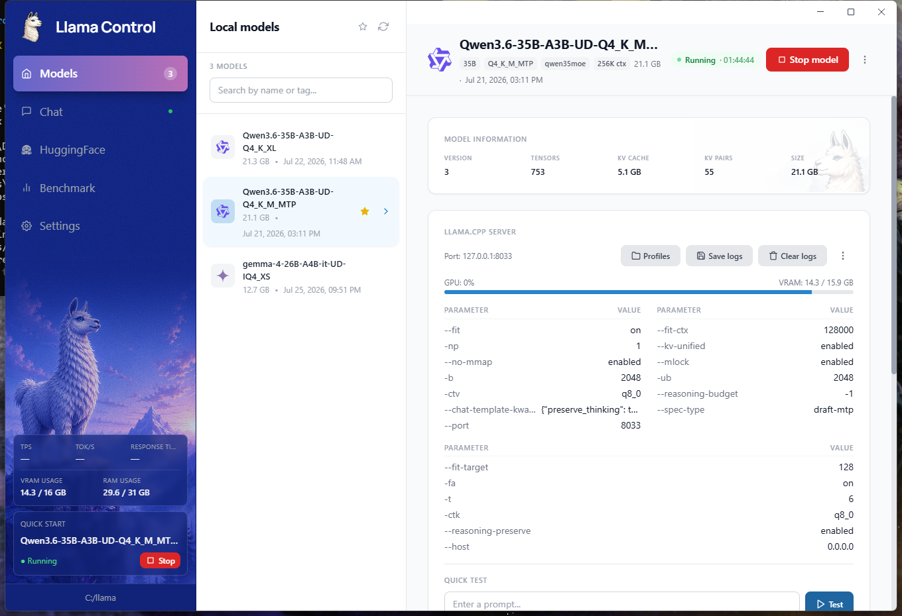
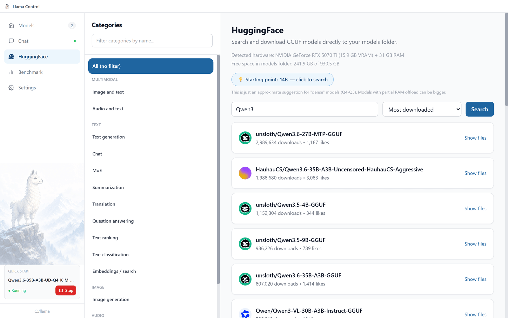
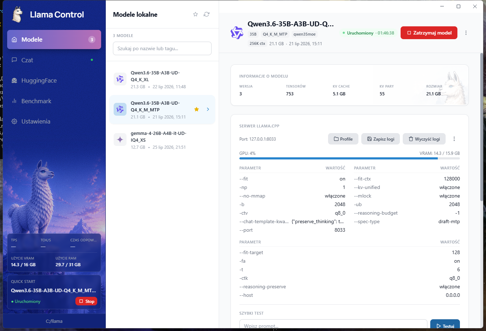
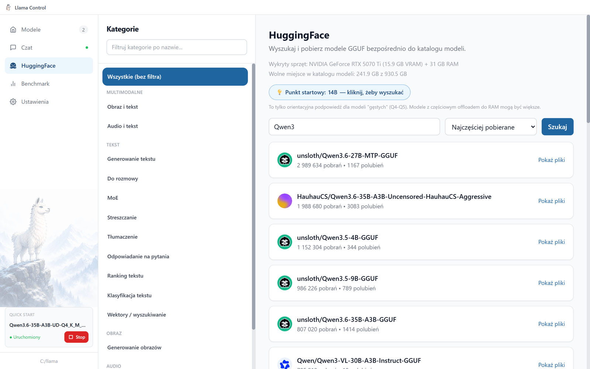
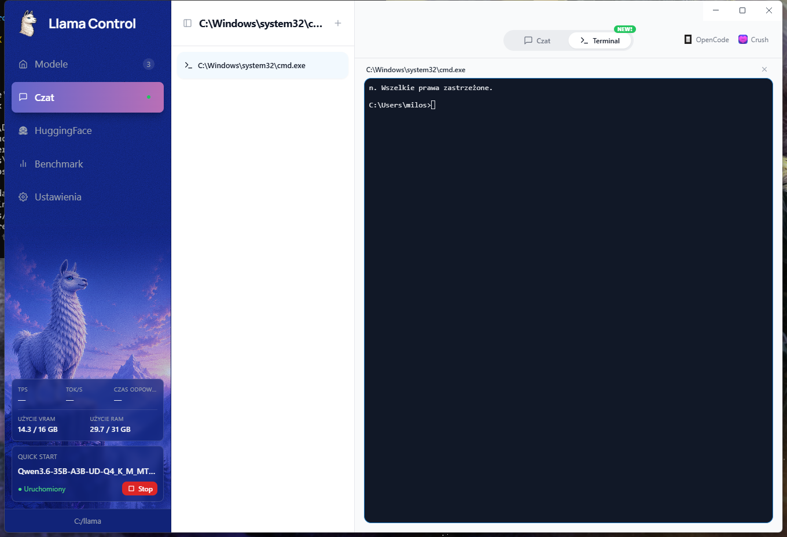

# Llama Control

**Run AI language models on your own PC — without ever touching a command line.**

**[English](#english)** · **[Polski](#polski)**

---

## English

**Llama Control** is a free desktop app that helps you run and manage AI language models (like a local "ChatGPT") on your own hardware. No account, no subscription, and your conversations never leave your computer.

### How it works

AI models live locally on your disk as files. To make a model actually "come alive" and let you talk to it, you need an engine to run it. Llama Control uses **[llama.cpp](https://github.com/ggml-org/llama.cpp)**, one of the most popular open-source engines for running AI models locally.

Llama Control is a friendly **wrapper** around that engine:

- **Keeps track of your models.** Shows a list, their size, when they were downloaded, and lets you tag them as favorites or add notes. Models from the well-known families — Qwen, Llama, Mistral, Gemma, DeepSeek, Nemotron — are recognised by their filename and shown with their logo.
- **Installs the llama.cpp engine for you** if you don't already have it, picking the right build for your graphics card.
- **Starts and stops a model with one click.** No typing anything into a console.
- **Lets you download new models** straight from HuggingFace (think of it as a "store" for AI models) and tells you right away whether a given model will fit in your GPU's memory.

  

- **Can figure out good settings for you, and actually checks them.** An AI assistant proposes a starting configuration for a model, then an "auto-tune" mode can launch it for real, test it under real load, and automatically back off to safer settings if something crashes — instead of just guessing and hoping.
- **Ships a built-in terminal**, side by side with chat. Split it into as many panes as you need, and each one keeps running — including whatever's inside it — even while you're looking at a different tab.

  

- **Updates itself** whenever a new version comes out.

In short: you install it, the app figures out the rest, you just click.

#### Why llama.cpp instead of Ollama or LM Studio?

This isn't meant to be another standalone AI engine competing with those. It's deliberately a **lightweight wrapper**, not a full application. Ollama and LM Studio are their own complete environments. They run in the background and use up memory and resources all the time, even when you're not doing anything. Llama Control doesn't have its own heavy engine running in the background. It simply turns `llama.cpp` on and off exactly when you want to use it, and doesn't eat your RAM or CPU/GPU power when you don't.

### What devices this works on

- **Windows only for now** (10 or 11): desktop or laptop. Doesn't work on phones or tablets.
- **NVIDIA, AMD and Intel graphics cards all get GPU acceleration** (NVIDIA via CUDA, AMD/Intel via Vulkan) — the app detects what you have and installs the right engine build automatically. No GPU at all still works, just slower (on the CPU alone).
- AI models can weigh from a few gigabytes to tens of gigabytes each, so it's worth having some free disk space.

#### Planned

- Optimization and support for **macOS and Linux** (currently Windows only).
- Widening the automatic configuration tester to cover more settings and hardware combinations, so more models get a verified-working setup with a single click.

### Privacy, and a word about the source code

Llama Control is free but **closed-source** — this repository holds the installers and this
description, not the code. You are being asked to run an unsigned `.exe` from someone you don't
know, so here is exactly what the app does over the network:

- **Your conversations never leave your computer.** The model runs locally through llama.cpp. There is no account, no telemetry, no analytics, no usage tracking.
- **It contacts HuggingFace** when you search for or download a model — the same thing your browser would do if you visited the site yourself.
- **It contacts GitHub** to check whether a newer llama.cpp build or a newer version of the app is available.
- **It contacts an AI provider only if you set that up.** Two optional features use *your own* API key (Anthropic, OpenAI or Google): auto-tune sends the model's technical details and your hardware specs to ask for a suggested configuration, and the benchmark scorer sends the built-in test question plus your model's answer to have it graded. Nothing else is sent, and with no key both features are simply off. Keys are stored encrypted with Windows' built-in DPAPI and go nowhere except the provider you chose.

That is the complete list. If running closed-source software is a dealbreaker for you, that's a
fair position — llama.cpp itself is open source and you can always drive it from the command line.

### Getting started

1. Download the latest installer from the **[Releases](../../releases)** tab on the right side of this page.
2. Run the downloaded `.exe` file.
3. Windows may show a blue warning screen ("Windows protected your PC"). That's normal for smaller independent apps without a paid signing certificate. Click **"More info" → "Run anyway"**.
4. Done. The app will guide you from there.

---

## Polski

**Llama Control** to darmowa aplikacja na komputer. Pomaga uruchamiać i ogarniać modele AI (takie jak lokalny "ChatGPT") na własnym sprzęcie. Bez konta, bez abonamentu, a Twoje rozmowy nie opuszczają Twojego komputera.

### Jak to działa

Modele AI trzymane są lokalnie na Twoim dysku jako pliki. Żeby taki model "ożył" i można było z nim rozmawiać, potrzebny jest silnik, który go uruchomi. Llama Control korzysta z **[llama.cpp](https://github.com/ggml-org/llama.cpp)**, jednego z najpopularniejszych, otwartoźródłowych silników do uruchamiania modeli AI lokalnie.

Llama Control to wygodna **nakładka** na ten silnik:

- **Pilnuje Twoich modeli.** Pokazuje listę, ile ważą, kiedy je pobrano, pozwala je oznaczać jako ulubione i opisywać. Modele ze znanych rodzin — Qwen, Llama, Mistral, Gemma, DeepSeek, Nemotron — rozpoznaje po nazwie pliku i pokazuje z ich logo.
- **Sam zainstaluje silnik llama.cpp**, jeśli go jeszcze nie masz. Dobiera odpowiednią wersję pod Twoją kartę graficzną.
- **Uruchamia i zatrzymuje model jednym kliknięciem.** Bez wpisywania niczego w konsoli.
- **Pozwala pobierać nowe modele** prosto z serwisu HuggingFace (to taki "sklep" z modelami AI) i od razu mówi, czy dany model zmieści się w pamięci Twojej karty graficznej.

  

- **Potrafi sama dobrać ustawienia i to sprawdzić.** Asystent AI proponuje konfigurację startową dla modelu, a tryb "auto-tune" może realnie ją uruchomić, przetestować pod prawdziwym obciążeniem i automatycznie cofnąć się do bezpieczniejszych ustawień, jeśli coś się wysypie — zamiast zgadywać na ślepo.
- **Ma wbudowany terminal**, obok czatu. Można go podzielić na tyle paneli, ile potrzeba, a każdy działa dalej — razem z tym, co w nim odpalone — nawet gdy patrzysz akurat na inną zakładkę.

  

- **Sama się aktualizuje**, gdy pojawi się nowa wersja.

Krótko: instalujesz, apka sama dogaduje resztę, Ty tylko klikasz.

#### Dlaczego llama.cpp, a nie np. Ollama albo LM Studio?

To nie jest kolejny, osobny silnik AI konkurujący z tamtymi. To celowo **lekka nakładka**, a nie pełna aplikacja. Ollama i LM Studio to swoje własne, kompletne środowiska. Siedzą w tle i zajmują pamięć oraz zasoby cały czas, nawet gdy nic nie robisz. Llama Control nie ma własnego, ciężkiego silnika działającego w tle. Po prostu włącza i wyłącza `llama.cpp` dokładnie wtedy, kiedy chcesz z niego skorzystać, i nie zabiera Ci RAM-u ani mocy komputera, kiedy tego nie robisz.

### Na jakich urządzeniach to działa

- **Obecnie tylko Windows** (10 lub 11): komputer stacjonarny lub laptop. Nie działa na telefonach ani tabletach.
- **Karty graficzne NVIDIA, AMD i Intel — wszystkie dostają przyspieszenie GPU** (NVIDIA przez CUDA, AMD/Intel przez Vulkan) — aplikacja sama rozpoznaje, co masz, i instaluje odpowiednią wersję silnika. Bez karty graficznej też zadziała, tylko wolniej (na samym procesorze).
- Modele AI potrafią ważyć od kilku do kilkudziesięciu gigabajtów, więc warto mieć trochę wolnego miejsca na dysku.

#### Plany na przyszłość

- Optymalizacja i wsparcie dla **macOS i Linuksa** (obecnie tylko Windows).
- Rozszerzenie automatycznego testera konfiguracji o więcej ustawień i kombinacji sprzętowych, żeby więcej modeli dostawało sprawdzoną, działającą konfigurację jednym kliknięciem.

### Prywatność i słowo o kodzie źródłowym

Llama Control jest darmowa, ale **zamkniętoźródłowa** — to repozytorium zawiera instalatory i ten
opis, a nie kod. Prosimy Cię o uruchomienie niepodpisanego pliku `.exe` od nieznajomej osoby, więc
poniżej jest dokładnie to, co aplikacja robi w sieci:

- **Twoje rozmowy nie opuszczają Twojego komputera.** Model działa lokalnie przez llama.cpp. Nie ma konta, telemetrii, analityki ani zbierania danych o użyciu.
- **Łączy się z HuggingFace**, gdy szukasz lub pobierasz model — czyli robi to samo, co Twoja przeglądarka, gdybyś wszedł na tę stronę ręcznie.
- **Łączy się z GitHubem**, żeby sprawdzić, czy jest nowsza wersja llama.cpp albo samej aplikacji.
- **Łączy się z dostawcą AI tylko wtedy, gdy sam to skonfigurujesz.** Dwie opcjonalne funkcje używają *Twojego własnego* klucza API (Anthropic, OpenAI lub Google): auto-tune wysyła dane techniczne modelu i parametry Twojego sprzętu, żeby zapytać o proponowaną konfigurację, a ocenianie benchmarków wysyła wbudowane pytanie testowe wraz z odpowiedzią Twojego modelu, żeby dostać ocenę. Nic poza tym nie jest wysyłane, a bez klucza obie funkcje są po prostu wyłączone. Klucze są szyfrowane wbudowanym mechanizmem Windows (DPAPI) i nie trafiają nigdzie poza wybranego przez Ciebie dostawcę.

To cała lista. Jeśli uruchamianie zamkniętoźródłowego oprogramowania jest dla Ciebie nie do
przyjęcia, to całkowicie zrozumiałe stanowisko — sam llama.cpp jest otwartoźródłowy i zawsze możesz
obsługiwać go z linii poleceń.

### Jak zacząć

1. Pobierz najnowszy instalator z zakładki **[Releases](../../releases)** po prawej stronie tej strony.
2. Uruchom pobrany plik `.exe`.
3. Windows może pokazać niebieski ekran ostrzegawczy ("Windows chronił Twój komputer"). To normalne dla mniejszych, niezależnych aplikacji bez płatnego certyfikatu podpisu. Kliknij **"Więcej informacji" → "Uruchom mimo to"**.
4. Gotowe. Aplikacja Cię poprowadzi.
